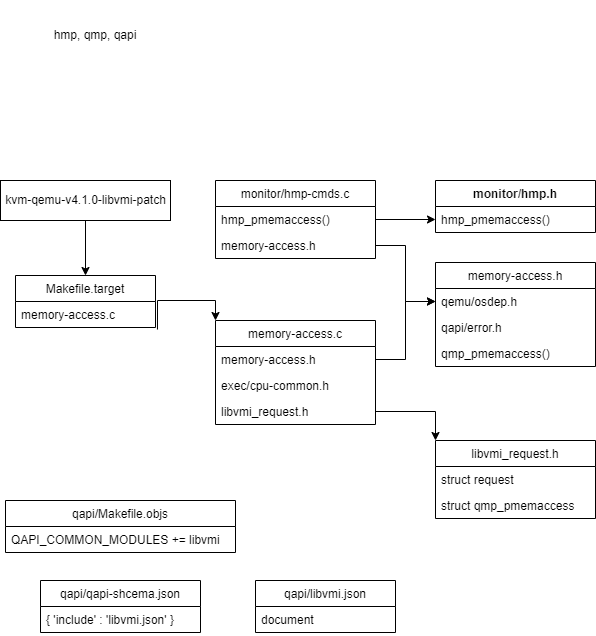

    我比较喜欢把结论放在文章开头，方便日后回头查阅。
# 核心结论
    1、HMP调用QMP接口，目的是为了写起来更简单；
    2、libVMI利用了QEMU的QMP机制，实现libVMI与QEMU进程间通信；

# 后续探讨
    1、libVMI变为QEMU的一个模块；
    2、libVMI + QEMU能不能变成一个调试器？

# QMP与HMP
QMP是一个基于JSON格式的文本交互模块，用于更改QEMU内部系统状态。
为了更简洁的开发，HMP在QMP上更简单清晰。
这里汇总一下官方文档：
docs/interop/qmp-intro.txt      最简单描述怎么用，怎么实验
docs/interop/qmp-spec.txt       详细介绍设计与语法规范
 /writing-monitor-commands.rst  介绍怎么开发一个HMP


# QAPI
QAPI是用于提供QEMU内外管理的一组C API，将C API映射到 Client JSON Protocol(QAPI schema?)，支持QMP和QGA。

/docs/devel/qapi-code-gen.txt       描述QAPI框架技术细节

# LibVMI与QEMU适配研究
HMP是QEMU上的简单交互式监视器，主要用于调试和简单的人类使用。更高级别的工具应该连接到QMP，它提供了与JSON的稳定接口，以便于可靠地解析。
```c
static uint64_t connection_read_memory (uint64_t user_paddr, void *buf, uint64_t user_len);
static uint64_t connection_write_memory (uint64_t user_paddr, void *buf, uint64_t user_len);
将一个物理地址（VM）映射到主机的虚拟地址，然后完成读写操作（将user_paddr拷贝进（出）user_paddr所在的内存）

static void send_success_ack (int connection_fd);
static void send_fail_ack (int connection_fd);
发送成功（失败）？信息到connection_fd

struct request {
    uint64_t type;      // 0 quit, 1 read, 2 write, ... rest reserved
    uint64_t address;  // address to read from OR write to
    uint64_t length;   // number of bytes to read OR write
};
static void connection_handler (int connection_fd);
connection_handler采用poll机制，（可能）收到来自LibVMI的指示，读（写）VM的paddr。
判断理由：connection_fd被放到pollfd中参与到事件循环。

struct pmemaccess_args {
    int socket_fd;
    struct sockaddr_un *address;
    socklen_t address_length;
    char *path; ?
    Error **errp;
};
static void *memory_access_thread (void *p)
从监听socket_fd接收外来连接，套接字信息保存在address中，然后调用connection_handler。
AF_UNIX用于在同一台机器上进程之间的通信。

void qmp_pmemaccess (const char *path, Error **errp)
建立PF_UNIX的TCP套接字,将address地址域设为AF_UNIX，然后在pmemaccess_args->socket_fd监听外部连接。
随后开启线程（memory_access_thread），屏蔽所有信号

void hmp_pmemaccess(Monitor *mon, const QDict *qdict)
path? hmp? qapi?

qapi-schema.json
qapi/libvmi.json
```

看起来，LibVMI的qemu-kvm-patch利用了QEMU的HMP（基于QAPI和QMP），通过进程间通信实现：LibVMI发号施令，经HMP传递命令（经进程间通信），让QEMU执行，再由HMP传递反馈。在QEMU中，进程间通信基于PF_UNIX，开启一个线程监听LibVMI的连接请求，利用poll机制处理连接。


# 调研小结
一言以蔽之，LibVMI使用了QEMU提供的HMP和QMP进行VM内外通信。QEMU通过HMP或QMP，接收来自LibVMI的指令，完成功能后，在通过HMP或QMP将执行结果返回给LibVMI。

HMP和QMP都是Client JSON Protocol，面向监控界面。
QAPI schema负责把Client JSON Protocol中的command等 map to C and to JSON.

通过QAPI schema，HMP和QMP调用QAPI，实现监控功能。

# libVMI与QEMU适配研究2
调研发现：
    1、相关接口没有改变
    2、Makefile.target——描述相关依赖改用Meson框架，一个基于python的自定义框架，Meson负责解析自定义语言；

因此，适配过程沿用kvm-qemu-v4.1.0-libvmi.patch，修改生成依赖的关系；
目前已经成功。

# 后续
从QEMU


猜想：若想将LibVMI集成到QEMU中，可不可以将patch中调用的QAPI筛选出来，将其与LibVMI进行适配？
        或者通过其他的方式完成集成？-》暂无头绪