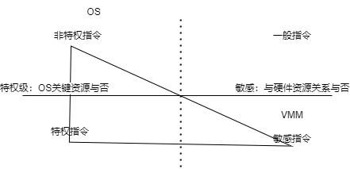

# 主线
虚拟化技术也是有发展历史的。从历史发展的视角看虚拟化技术，我觉得很有意思。
虚拟化概念在计算机领域无处不在，比如：进程、文件系统、虚拟内存等。

在如今，人们遇到一个很有意思的问题：买那么多架构的硬件 __too expensive__，只买一台行不行？——虚拟化
                                 买了那么多硬件，空闲太浪费了，能不能面向用户租出去？——云计算（核心是虚拟化技术）

需求和市场契合，人们开始认真研究怎么弄。
## 从CPU看指令划分
（为啥不看操作系统？—— 操作系统又不是轮子，没有CPU怎么跑？）

CPU是一个高度集成的电路板，提供各种逻辑运算，具体的表现是 __指令__。

从硬件的角度来看，指令被分为敏感指令和非敏感指令。敏感指令与硬件资源相关。

从使用者的角度来看，指令被分为特权指令和非特权指令。特权指令与系统的关键资源相关。

__注意__：系统关键资源$\subseteq$硬件资源，因此: 特权指令 + 部分非特权指令 = 敏感指令

## 从CPU看指令分级
指令划分是为了保护硬件资源。

在理论上，CPU将指令划分为4个等级，对应ring 0 ~ 3。数字越低，权限越高。操作系统内核，作为管理硬件资源的“大家长”，自然必须有最大的权限ring 0。如果一个ring 3的程序需要行使ring 0的部分功能，必须通过系统调用让“大家长”干完后

一台设备虽然不可能同时有两个“董事长”，但可以有几个“副董事长”，在董事长的同意下代行权力。

如果我要模拟运行一台新的、不同于硬件架构的计算机，我该运行在哪个等级？

两种分类方法没有