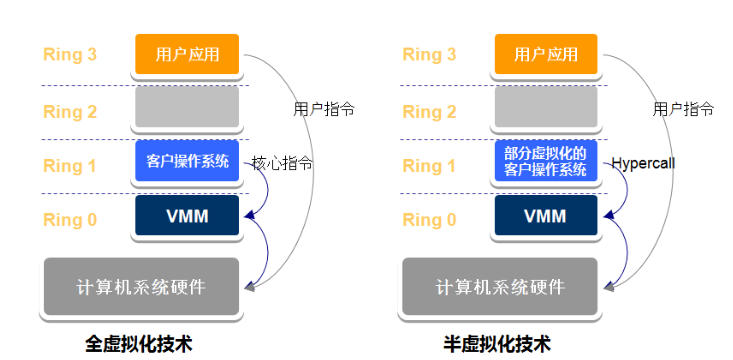
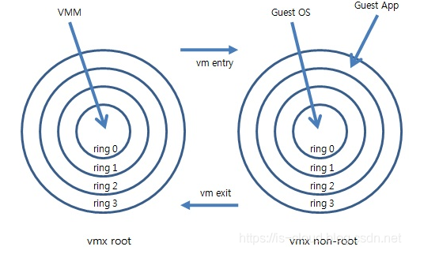

# 主线
虚拟化技术也是有发展历史的。从历史发展的视角看虚拟化技术，我觉得很有意思。
虚拟化概念在计算机领域无处不在，比如：进程、文件系统、虚拟内存等。

在如今，人们遇到一个很有意思的问题：买那么多架构的硬件 __too expensive__，只买一台行不行？——虚拟化
                                 买了那么多硬件，空闲太浪费了，能不能面向用户租出去？——云计算（核心是虚拟化技术）

需求和市场契合，人们开始认真研究怎么弄。

## 指令困局
### 从CPU看指令分类
（为啥不看操作系统？—— 操作系统又不是轮子，没有CPU怎么跑？）

CPU是一个高度集成的电路板，提供各种逻辑运算，具体的表现是 __指令__。

从硬件的角度来看，指令被分为敏感指令和非敏感指令。敏感指令与硬件资源相关。

从使用者的角度来看，指令被分为特权指令和非特权指令。特权指令与系统的关键资源相关。

__注意__：系统关键资源$\subseteq$硬件资源，因此: 特权指令 + 部分非特权指令 = 敏感指令

### 从CPU看指令分级
指令划分是为了保护硬件资源。

在理论上，CPU将指令划分为4个等级，对应ring 0 ~ 3。数字越低，权限越高。操作系统内核，作为管理硬件资源的“大家长”，自然必须有最大的权限ring 0。如果一个ring 3的程序需要行使ring 0的部分功能，必须通过系统调用让“大家长”干。

一台设备虽然不可能同时有两个“大家长”，但可以有几个“二当家”，在董事长的同意下代行权力（模块或者驱动作为内核的一部分）。

如果我要模拟运行一台新的、不同于硬件架构的计算机，我该运行在哪个等级？

### 指令对虚拟化的影响
由于部分非特权指令可能也是敏感指令，攻击者可以利用这个特点攻击计算机硬件，影响宿主机。

若特权指令=敏感指令，则称呼该指令集系统能够支持虚拟化。（可惜x86没有达到要求 :) ）

## 虚拟化技术发展与CPU指令
虚拟化技术的发展收到CPU指令的影响：。该问题同时引申出管理VM的VMM运行在哪个等级。VMM有模拟或调用硬件资源的功能，因此必须运行在ring 0级，典型的有：KVM。因此，VM只能运行在其他等级，或者借助硬件运行在ring 0级。

宏观上，将有无硬件辅助来区分虚拟化的技术发展；

### 无硬件辅助：半虚拟化、全虚拟化

半虚拟化和全虚拟化技术，VMM运行在ring 0级。来自Guest OS的敏感指令被VMM截获，可以通过改变指令调用的方式：对VMM的调用（半虚拟化）或动态翻译将特权转成非特权（全虚拟化）

然而，由于VMM的介入，执行效率有待商榷。

### 有硬件辅助： 硬件虚拟化
目前，硬件虚拟化有两家：Intel VT-x和AMD ，都基于x86架构。

新的引入：VMX（Virtual Machine Extened)，新的寄存器VMCS，新模式VMX root mode和VMX non-root mdoe。

为了与指令集分级相匹配，习惯上，VMX non-root被称为ring -1级。这使得VMM上的代码可以和Guest OS代码来回切换执行。具体切换方法为VM entry和VM exit。

本文研究的内容为QEMU-KVM，